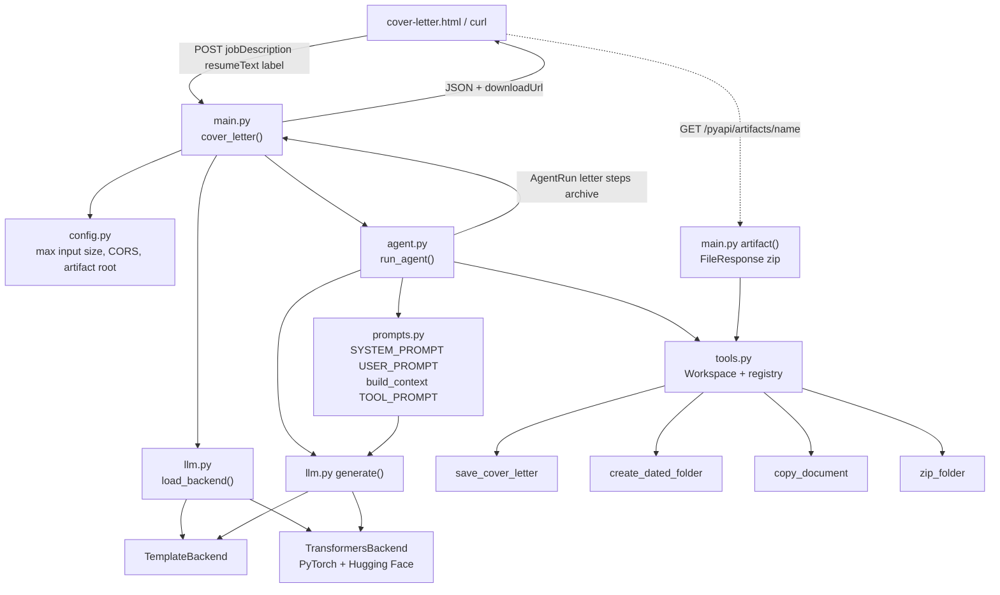

# Regina's website

One Node process serves the HTML site and the WhatsApp webhook.

```bash
docker-compose up -d --build
```

Then open `http://<host>:9000`. Meta webhook URL: `https://<host>/webhook` (or `http://<host>:9000/webhook` if you terminate TLS elsewhere).

Env file: `env.env` in this directory (not baked into the image).

```bash
npm test
npm run simulate
```


`POST /pyapi/cover-letter` flows through these modules:



| Module | Role on this request |
|---|---|
| `main.py` | HTTP in/out, size checks, lazy `get_backend()`, zip URL |
| `config.py` | Limits, origins, model id, artifact root |
| `prompts.py` | Fixed system/user text and the job+resume context |
| `llm.py` | Writes the letter (template or HF/PyTorch) |
| `agent.py` | Calls generate, plans tools, runs them in order |
| `tools.py` | Date folder, save doc, copy, zip — paths stay inside the workspace |